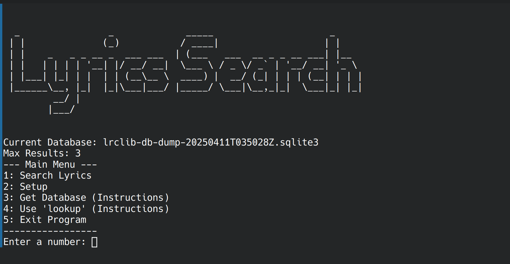

# lyrics-search
Tool to quickly gather lyrics of songs



```
python main.py
```
```
lyrics-search
```

## Setup
1. Download the "main.py" script or the .rpm Version.
2. Visit https://lrclib.net/db-dumps (External site. I am not affiliated with the site in any way.) to download the latest version of the database as a .gz file.
3. Unzip the .gz file to a .sqlite3 file.
4. Run "python main.py". You can also install the .rpm package and run "lyrics-search".
5. Select option 3 “setup”.
6. Follow the setup instructions.

## Install RPM Package
1. Download the latest .rpm file (or build it) from GitHub Releases
2. Install it via Package manager (DNF, Zypper ...)
3. Use it with "lyrics-search" instead of "python main.py"
(You can remove the package with your package manager and the package name "lyrics-search")

## Lookup Argument
there is a lookup argument with which you can quickly find lyrics to use the output in other programs
```
python main.py lookup “search query"
```
The output will be the first result that is found, together with the song name, artist name and lyrics. It is JSON formatted.

## Build the RPM File
(On openSUSE Tumbleweed)
1. Install Tools "sudo zypper install rpmbuild python3-setuptools python3-devel"
2. Clone Repository "https://github.com/DasIstTobias/lyrics-search.git"
3. Move in repository "cd lyrics-search"
4. Create Build directory "mkdir -p ~/rpmbuild/{SOURCES,SPECS,BUILD,RPMS,SRPMS}"
5. Create Source "python setup.py sdist --formats=gztar"
6. Copy Source to Build directory "cp dist/lyrics-search-*.tar.gz ~/rpmbuild/SOURCES/"
7. Create .spec File "nano ~/rpmbuild/SPECS/lyrics-search.spec". Example File:
   ```lyrics-search.spec
   %define version 1.2
   %define release 3

   Name:           lyrics-search
   Version:        %{version}
   Release:        %{release}%{?dist}
   Summary:        Tool to quickly gather lyrics of songs

   License:        GPLv3
   URL:            https://github.com/DasIstTobias/lyrics-search
   Source0:        lyrics_search-1.2.tar.gz

   BuildRequires:  python3-devel
   BuildRequires:  python3-setuptools

   Requires:       python3 >= 3.11

   BuildArch:      noarch

   %description
   Tool to quickly gather lyrics of songs

   %prep
   %autosetup -n lyrics_search-1.2

   %build
   %py3_build

   %install
   %py3_install

   %files
   %license LICENSE
   %doc README.md
   %{_bindir}/lyrics-search
   %{python3_sitelib}/lyrics_search/
   %{python3_sitelib}/lyrics_search-%{version}-py*.egg-info

   %changelog
   * $(LANG=C date "+%a %b %d %Y") DasIstTobias placeholder@example.com - %{version}-%{release}
   - Update to version %{version}

   * Sun May 04 2025 DasIstTobias placeholder@example.com - 0.1.0-1
   - Initial RPM package build.
   ```
8. Build the RPM File "rpmbuild -ba ~/rpmbuild/SPECS/lyrics-search.spec"
9. The RPM File is saved in "~/rpmbuild/RPMS/noarch/"

## Disclaimer
This is my program for searching song lyrics. For that purpose I use the database of lrclib.net .  
I am in no way affiliated with lrclib.net and am not the author of the used database.  
Visit lrclib.net on GitHub: https://github.com/tranxuanthang/lrclib .
