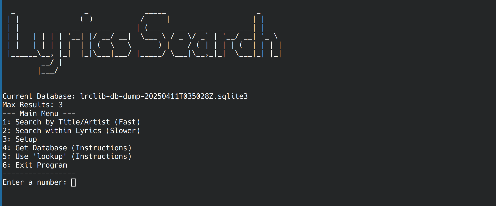

# lyrics-search
Tool to quickly gather lyrics of songs



```
python lyrics-search.py
```

## Setup
1. Download the "lyrics-search.py" script.
2. Visit https://lrclib.net/db-dumps (External site. I am not affiliated with the site in any way.) to download the latest version of the database as a .gz file.
3. Unzip the .gz file to a .sqlite3 file.
4. Run "lyrics-search.py".
5. Select option 3 “setup”.
6. Follow the setup instructions.

## Lookup Argument
there is a lookup argument with which you can quickly find lyrics to use the output in other programs
```
python lyrics-search.py lookup “search query"
```
The output will be the first result that is found, together with the song name, artist name and lyrics. It is JSON formatted.

## Disclaimer
This is my program for searching song lyrics. For that purpose I use the database of lrclib.net .  
I am in no way affiliated with lrclib.net and am not the author of the used database.  
Visit lrclib.net on GitHub: https://github.com/tranxuanthang/lrclib .
